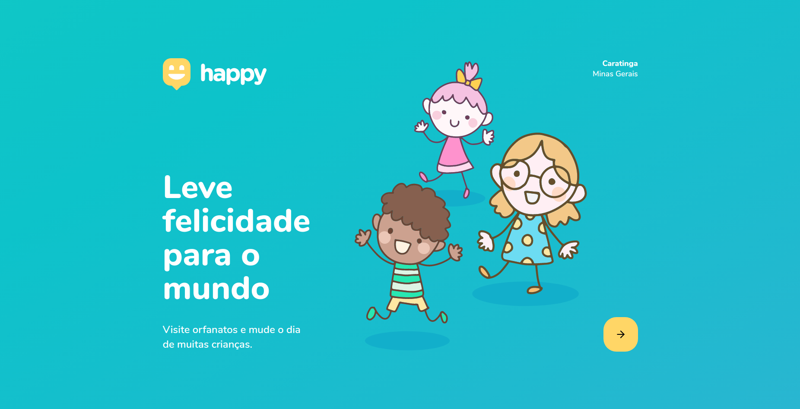
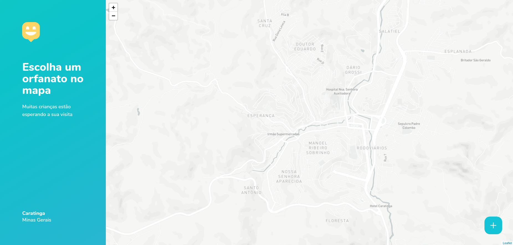

<h1 align="center">
	    
</h1>
​	

	<a href="#sobre"> Sobre </a>&nbsp;&nbsp;&nbsp;|&nbsp;&nbsp;&nbsp;
  <a href="#techs"> Tecnologias </a>&nbsp;&nbsp;&nbsp;|&nbsp;&nbsp;&nbsp;
  <a href="#run"> Como usar </a>&nbsp;&nbsp;&nbsp;

  

  

  

## Sobre 🚀 <a name="sobre" />

O **Happy** é uma aplicação ministrada pela [Rocketseat](https://rocketseat.com.br/) no evento `NLW(Next Level week)`. Ao final da semana terei uma aplicação completa que possui back-end, front-end e mobile. Está aplicação tem como objetivo levar as pessoas até orfanatos e trazer a felicidade para as crianças

## Techs ​⚙ ​<a name="techs" />

- TypeScript
- NodeJS
- ReactJS
- React Native

## Instalação e execução ​ℹ️ ​<a name="run" />

1. Faça um clone desse repositório;

#### Backend

1. Entre na pasta rodando `cd backend`;
2. Rode `yarn` para instalar as dependências;
3. Rode `yarn dev`;
4. Rode `yarn migration:run` para executar todos as migrations do banco de dados;

#### Frontend

1. Entre na pasta rodando `cd web`;
2. Rode `yarn` para instalar as dependências;
3. Rode `yarn start`;

#### Mobile

1. Entre na pasta rodando `cd mobile`;
2. Com o `expo` instalado rode `yarn` para instalar as dependências;
3. Rode `yarn start`;
4. Com seu celular escaneie o QR Code que irá aparecer na página ou rode diretamente em um emulador instalado em sua máquina;